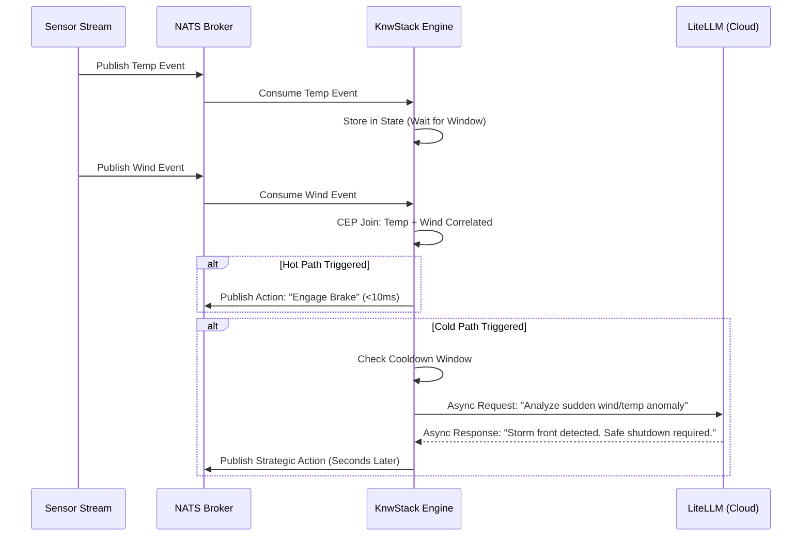
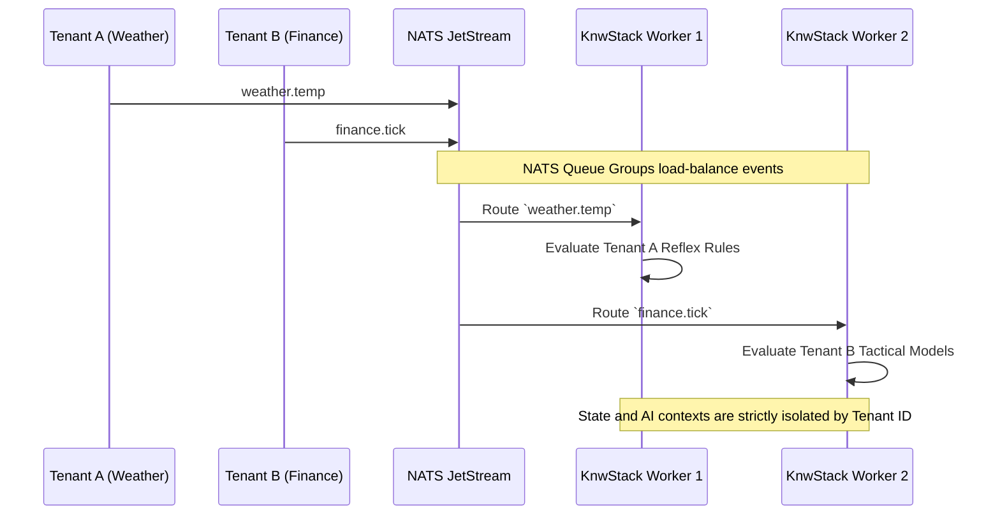
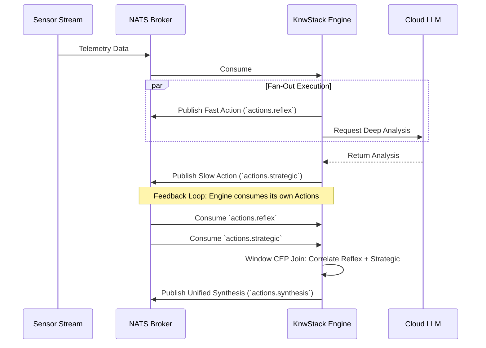

# KnwStack: Architecture Design Document

## 1. Executive Summary

KnwStack is a Real-Time AI Framework that implements the **"Split-Brain"** paradigm. Traditional streaming architectures (like Kappa or Lambda) handle high-velocity data efficiently but struggle to integrate non-deterministic, high-latency Large Language Models (LLMs) into the critical path. Conversely, standard AI agent frameworks (like LangChain) are stateful and request-oriented, making them too slow to react to physical or high-frequency anomalies.

KnwStack acts as an opinionated Complex Event Processing (CEP) router. It ingests massive data streams and splits the processing logic into latency-specific paths:
*   **The Reflex Path (Hot):** Sub-10ms deterministic execution for immediate actions.
*   **The Tactical Path (Warm):** Sub-100ms execution for local ML/SLM models.
*   **The Strategic Path (Cold):** Asynchronous, seconds-latency execution for deep LLM reasoning.

## 2. High-Level System Architecture

KnwStack is built on a **Python + Rust Edge Stack** utilizing NATS JetStream for messaging and Bytewax for stateful stream processing.

```mermaid
graph TD
    %% External Data Sources
    S1[Telemetry Sensors] -->|JSON/Protobuf| NATS
    S2[Market Ticks] -->|JSON/Protobuf| NATS
    S3[App Logs] -->|JSON/Protobuf| NATS

    subgraph Messaging Backbone
        NATS[(NATS JetStream)]
    end

    subgraph KnwStack Engine [KnwStack Bytewax Engine (Rust/Python)]
        Ingest[Input Connector] --> Router{Multi-Tier Router}
        
        %% State Management
        State[(In-Memory Context Window / CEP State)]
        Router <--> State
        
        %% The Paths
        Router -->|Hot| Reflex[Reflex Rules <br> <10ms]
        Router -->|Warm| Tactical[Tactical Models <br> <100ms]
        Router -->|Cold| Batched[Event Batcher]
        
        Batched --> Strategic[Strategic Prompts <br> LLM Orchestration]
    end

    %% External AI
    Strategic -->|API Call| LLM((Cloud LLMs via LiteLLM))
    LLM --> Strategic
    
    %% Outputs
    NATS --> Ingest
    Reflex -->|Immediate Action| Output[Action Dispatcher]
    Tactical -->|Classification| Output
    Strategic -->|Complex Plan| Output
    Output -->|Publish| NATS
```

## 3. Sequence Diagrams

### 3.1 Standard Event Lifecycle & CEP Joins

The following sequence illustrates how KnwStack aggregates multiple streams (e.g., Temperature and Wind) and handles both a rapid Reflex action and a delayed Strategic response.



### 3.2 Multi-Tenant Concurrency

KnwStack supports executing entirely isolated business logic for different tenants simultaneously by leveraging NATS topic hierarchies (`tenant.app.event`) and Bytewax's distributed workers.



### 3.3 Synthesis & Feedback Loops (Correlation)

While the fundamental architecture acts as a "Fan-Out" (executing fast rules and slow LLM prompts in parallel), KnwStack natively supports **Correlation and Synthesis**. Because all execution paths publish their decisions back onto NATS JetStream (e.g., `actions.reflex` and `actions.strategic`), the framework can subscribe to its own output stream. 

By feeding the output streams back into a CEP Window, the engine can correlate the immediate physical reflex with the delayed AI reasoning to form a unified, synthesized decision.



## 4. Key Design Decisions

### 4.1 Messaging: NATS JetStream over Apache Kafka
*   **Decision:** We exclusively use NATS JetStream instead of Apache Kafka.
*   **Rationale:** Kafka is the undisputed standard for enterprise big data, but it carries immense operational overhead, JVM memory bloat, and Zookeeper/KRaft complexity. NATS is a single, lightweight Go binary that provides the required at-least-once/exactly-once delivery, replayability, and high-throughput routing necessary for a responsive Edge AI framework.
*   **Multi-Tenancy:** NATS subject-based routing (`tenantA.app1.telemetry`) is highly flexible, allowing the framework to subscribe to wildcard patterns and isolate tenant data natively.

### 4.2 Stream Processing: Bytewax (Python/Rust) over Apache Flink (Java)
*   **Decision:** The core CEP engine and state management are built using Bytewax instead of Java-based Apache Flink.
*   **Rationale:** To provide a best-in-class developer experience for AI engineers, the framework's API must be Python. However, pure Python stream processors usually lack the performance needed for the Hot Path (<10ms). Bytewax solves this: it is a Python API wrapped around the **Timely Dataflow** engine written in **Rust**.
*   **Impact:** We achieve the extreme performance, memory safety, and native stateful windowing of a compiled language (Rust), while allowing the end-user to write their `@reflex_rule` and `@strategic_prompt` logic entirely in Python. This eliminates the need to maintain a complex Polyglot (Java + Python) architecture.

### 4.3 AI Orchestration: LiteLLM
*   **Decision:** We use LiteLLM for routing calls to external models instead of heavy orchestration frameworks like LangChain (for the core routing layer).
*   **Rationale:** LiteLLM provides a standardized, OpenAI-compatible interface to call over 100+ different LLM providers. In a high-throughput streaming environment, we need to keep the overhead as low as possible. Heavy prompt-chaining frameworks can introduce unnecessary latency and state complications; LiteLLM keeps the "Cold Path" network calls lean and agnostic to the backend provider.
