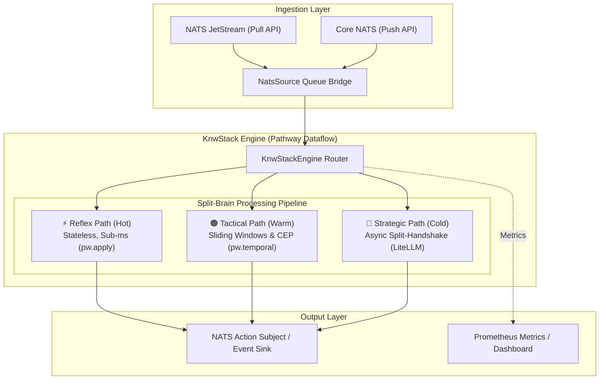
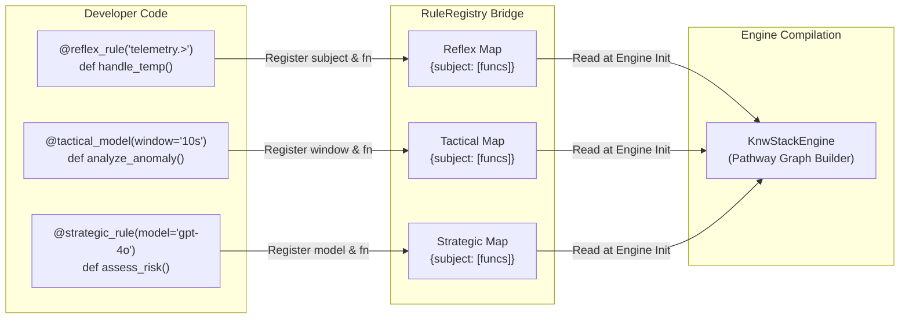
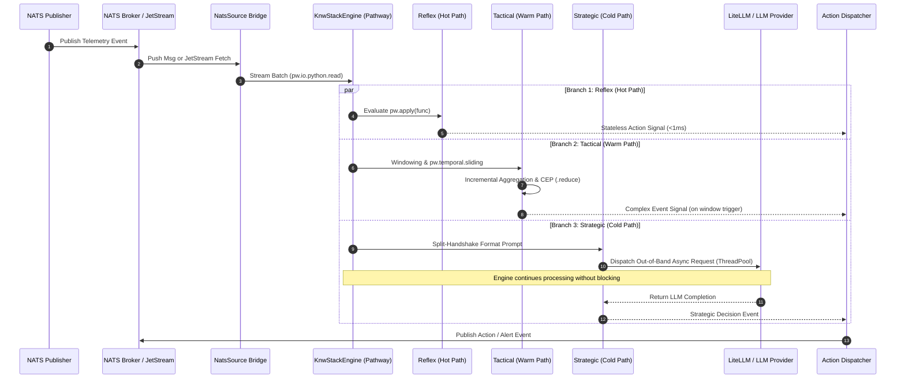
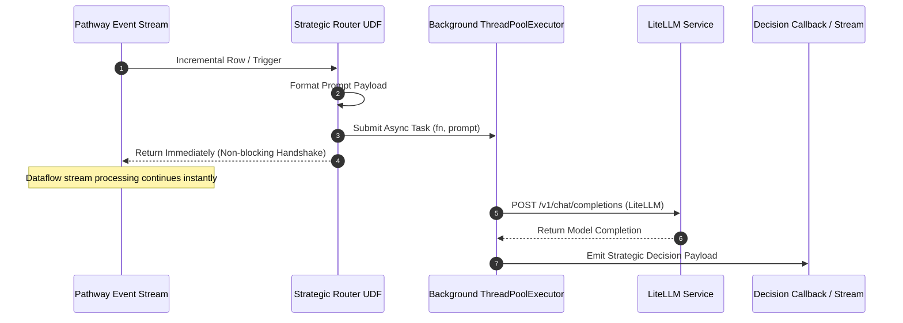

# KnwStack Technical Deep Dive
*A Code-Level Walkthrough of the Split-Brain Engine*

This document explores the internal implementation of KnwStack. It is intended for developers who want to understand how Python decorators are transformed into a high-performance, incremental dataflow powered by **Pathway**, **NATS JetStream**, and **LiteLLM**.

> [!NOTE]
> KnwStack operates on a **Split-Brain** architecture that segregates streaming logic into three distinct latency tiers: **Reflex (Hot)**, **Tactical (Warm)**, and **Strategic (Cold)**.



---

## 1. The Registry Bridge (`api/decorators.py`)

The core of the developer experience is the `RuleRegistry`. Unlike many frameworks that use complex inheritance, KnwStack uses a simple metadata store.

### 1.1 Metadata Storage & Registration Flow
When you use `@reflex_rule`, `@tactical_model`, or `@strategic_rule`, the decorator doesn't wrap the function in a complex class. Instead, it registers the function and its subject filter into internal registries within `RuleRegistry`:

```python
# Internal structure
self.reflex_rules = {
    "telemetry.>": [func1, func2],
    "alarms.*": [func3]
}
```



### 1.2 Test Isolation Mechanics
In `decorators.py`, we implemented a `clear()` method. This is critical because `pytest` runs in a single process by default. Without this, rules from `test_a.py` would leak into `test_b.py`. We use an **autouse fixture** in `tests/conftest.py` to trigger this clear before every single test.

---

## 2. The Engine & Runner Architecture (`engine/router.py`)

KnwStack professionalizes its execution environment by decoupling the **Graph Definition** from the **Execution Lifecycle**.

### 2.1 `KnwStackEngine` (The Graph) & `KnwStackRunner` (The Lifecycle)
The `KnwStackEngine` class is responsible solely for building the Pathway dataflow graph. It gathers all registered rules from the `api` layer and constructs the Hot, Warm, and Cold path branches. It is a "stateless" definition of your intelligence pipeline.

The `KnwStackRunner` manages how the engine is executed:
*   **Headless Mode**: The default for production. Disables the terminal UI and monitoring servers for maximum performance and silence.
*   **Dashboard Mode**: Enables a Prometheus-compatible metrics server. In Community Edition, this also applies a "Silence Patch" to suppress the flickering terminal UI while keeping the `/metrics` endpoint active.

### 2.2 Event Processing Lifecycle & Sequence

The diagram below illustrates the end-to-end lifecycle of telemetry events moving from ingestion through the three Split-Brain execution branches to action output:



### 2.3 Branch 1: The Hot Path (Reflex)
Implemented in `apply_reflex`. This uses `pw.apply`.
*   **Why `pw.apply`?** It is a stateless operation. It takes one row and returns one row. This is the fastest possible path in Pathway because there is no windowing or state-shuffling involved.

### 2.4 Branch 2: The Warm Path (Tactical)
Implemented in `run_tactical`. This is where complex event processing (CEP) occurs.
*   **Windowing**: We use `pw.temporal.sliding(duration=length_s, step=slide_s)`. Pathway's engine maintains an incremental buffer of these events.
*   **Aggregation**: We use `.reduce()` to group events by their key (e.g., `building_id`). This is how we support **Multi-Pod Correlation**—Pathway ensures the same key always lands in the same window.

### 2.5 Branch 3: The Cold Path (Strategic) & The Async Split-Handshake
Implemented in `run_strategic`.

> [!IMPORTANT]
> **The Async Paradox**: Pathway is a synchronous incremental engine. If we called an LLM inside the dataflow loop directly, the entire streaming engine would freeze waiting for HTTP responses.



### 2.6 CEP Internals: How "Warm" Logic Works
KnwStack implements CEP via **Incremental Windows**:
*   **`stream.groupby()`**: Before windowing, the engine groups events by a key (e.g., `building_id`). This ensures that multiple entities can be processed in parallel while keeping their states isolated.
*   **Incremental Reducers**: Pathway doesn't re-calculate the window from scratch when a new event arrives. It uses an incremental state update (adding the new value and dropping the expired one). This allows KnwStack to perform CEP on thousands of concurrent windows with sub-millisecond overhead.
*   **The Trigger**: The `@tactical_model` receives a "Table" of the current window. If your logic returns a dictionary, the engine treats it as a "CEP Signal" and routes it back to the NATS action subject.

---

## 3. NATS Connector (`connectors/nats.py`)

Our NATS implementation solves the **Push-to-Pull Bridge** problem. Pathway's incremental engine requires a source that can be "pulled" (polled), while NATS offers both Push and Pull modes.

```mermaid
flowchart TD
    subgraph NATS Sources
        JS["NATS JetStream Stream"]
        CORE["Core NATS Subject"]
    end

    subgraph Bridge Layer ("connectors/nats.py")
        JS_PULL["JetStream Pull API<br/>(fetch batch)"]
        PUSH_SUB["NATS Push Subscription<br/>(Async Callback Thread)"]
        QUEUE[("Thread-Safe Local Queue<br/>(collections.deque / Queue)")]
    end

    subgraph Engine Layer
        PW_SOURCE["NatsSource (pw.io.python.read)"]
        PW_GRAPH["Pathway Dataflow Engine"]
    end

    JS -->|Controlled Batch Pull| JS_PULL
    CORE -->|High-Speed Push| PUSH_SUB
    
    PUSH_SUB -->|Enqueue Message| QUEUE
    JS_PULL -->|Direct Batch Yield| PW_SOURCE
    QUEUE -->|Dequeue / Poll Batch| PW_SOURCE

    PW_SOURCE -->|Yield Micro-batch| PW_GRAPH
```

### 3.1 JetStream (Native Pull)
For persistent streams, we use the NATS JetStream **Pull API** (`fetch()`). This allows the Pathway engine to control backpressure—it only requests a batch of messages when it is ready to compute the next incremental update.

### 3.2 Core NATS (Push-to-Pull Bridge)
Core NATS is inherently Push-based. To integrate this with Pathway, we implemented a **Queue-Based Bridge**:
1.  **Subscription**: The connector opens a standard NATS Push subscription in a background thread.
2.  **Buffering**: Incoming "pushed" messages are immediately placed into a thread-safe local queue.
3.  **Ingestion**: Our `NatsSource` generator then "pulls" from this local queue and yields the data to Pathway.

> [!TIP]
> This architecture ensures that the high-speed **Reflex (Hot)** path can receive Push-based events while maintaining the stable, pull-driven dataflow architecture that Pathway requires.

---

## 4. Operational Narrative (Observability)

The "Narrative" logs are implemented using a custom `logging` wrapper that inspects the `path_type` of the rule being executed. This allows us to inject the `⚡ [INGEST]` and `🟠 [WARM]` labels at the precise moment the router dispatches a rule, providing a visual trace of the "Split-Brain" in action.

---

## 5. Scaling to Millions (The Performance Ceiling)

During our "Mega-Stress" tests, KnwStack demonstrated its ability to ingest massive event bursts. However, handling **Millions of Events per Second** while maintaining sub-second latency requires a transition from "Single-Node Dev" to "Distributed Production".

### 5.1 Horizontal Logic Scaling
The primary bottleneck in a Python-based engine is the GIL and UDF execution time. To scale logic:
*   **Pathway Clusters**: Deploy KnwStack across a Pathway cluster to distribute the dataflow graph across multiple CPUs and nodes.
*   **NATS Partitioning**: Use NATS JetStream partitions to load-balance traffic across multiple independent KnwStack "Logic Pods".

### 5.2 Optimizing the "Split-Brain"
For high-frequency paths:
*   **Native Rules**: Move critical Hot Path (Reflex) logic into native Pathway expressions (avoiding Python UDFs where possible).
*   **Batching**: The engine automatically batches events, but increasing the `max_expression_batch_size` in the config can further improve throughput at the cost of slight latency increase.

---
*Technical Deep Dive: May 2026*

